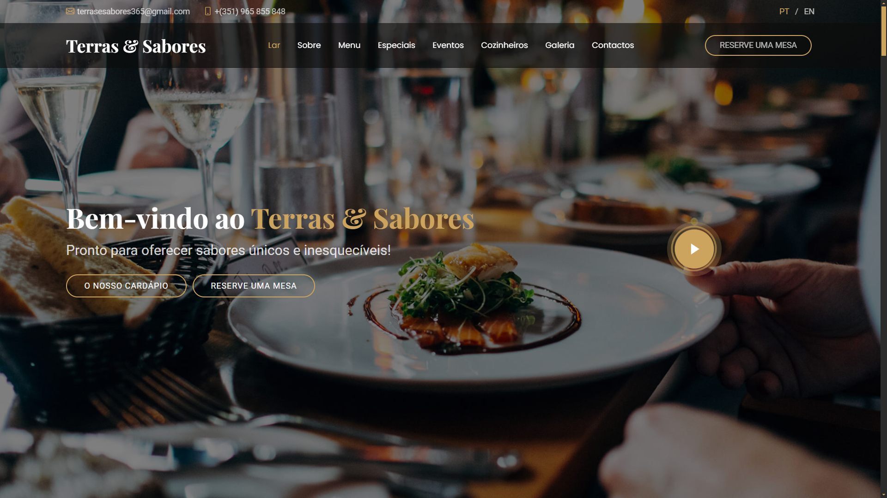

 

<h1 align="center">Terras & Sabores 🍽️</h1>

Explorando Sabores, Conectando Culturas
 

Bem-vindo ao repositório oficial do site do restaurante Terras & Sabores, onde unimos a tradição culinária portuguesa com os sabores internacionais mais apreciados. Este website foi criado para oferecer aos nossos clientes uma experiência completa, desde a descoberta do nosso cardápio até a reserva de eventos especiais.

<h1>Sobre o Restaurante 🍴</h1>

No Terras & Sabores, levamos você a uma viagem gastronômica que une a rica tradição portuguesa com os sabores vibrantes de outras culturas. Cada prato conta uma história, cada refeição é uma celebração de encontros. Ao entrar em nosso restaurante, você não apenas saboreia uma refeição; você vivencia uma imersão nas tradições que moldaram nossa culinária e nas influências que nos inspiram.

<ul>
    <li>Tradição portuguesa em seu melhor, com pratos que aquecem o coração.</li>
    <li>Uma seleção única de sabores internacionais para explorar.</li>
    <li>A experiência que une a essência das nossas raízes com a diversidade global.</li>
    <li>Um ambiente acolhedor, ideal para celebrar momentos especiais.</li>
</ul>

Venha descobrir um lugar onde as tradições e inovações se encontram, e onde cada refeição cria uma nova memória. No Terras & Sabores, a sua experiência gastronômica é uma jornada de sabores e uma celebração de culturas, sempre acolhendo você com braços abertos e um sorriso caloroso.

<h1>Funcionalidades 🔥</h1>

<ul>
    <li>Navegação Intuitiva: Fácil acesso ao menu, promoções, eventos e informações sobre o restaurante.</li>
    <li>Menu Interativo: Explore o nosso cardápio completo, com descrições detalhadas de cada prato e promoções especiais.</li>
    <li>Reservas Online: Reserve eventos diretamente pelo site e planeje aniversários, festas privadas ou eventos personalizados.</li>
    <li>Depoimentos: Leia o que os nossos clientes têm a dizer sobre a experiência no Terras & Sabores.</li>
    <li>Política de Privacidade e Termos de Serviço: Transparência na proteção de dados e nas condições de uso do nosso website.</li>
</ul>

<h1>Licença 📜</h1>

Este projeto está licenciado sob a licença MIT - veja o arquivo [MIT License](./LICENSE) para mais detalhes.

<h1>Contato 📧</h1>

 Caso tenha dúvidas ou sugestões, sinta-se à vontade para entrar em contato:
<ul>
    <li>E-mail: terrasesabores365@gmail.com</li>
    <li>Telefone: +(351) 965 855 848</li>
    <li>Endereço: Praça Marquês de Pombal, 1253-305 Lisboa Portugal</li>
</ul>
